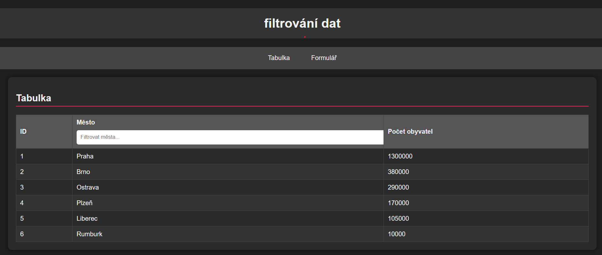
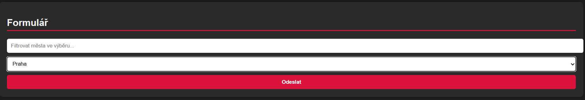

# Filtrování dat měst

Jednoduchá webová stránka v HTML, CSS a JavaScriptu, která umožňuje:

- zobrazit tabulku měst a počtu obyvatel
- filtrovat města v tabulce pomocí textového pole
- vybrat město ze seznamu (`<select>`) a zobrazit výsledek

## Funkce

### 1. Tabulka měst
- Tabulka obsahuje ID, název města a počet obyvatel.
- Města je možné filtrovat pomocí vstupního pole nad tabulkou.
- Filtrace funguje na základě části názvu města (case-insensitive).

### 2. Formulář s výběrem města
- Select obsahuje seznam měst.
- Je možné filtrovat města ve výběru pomocí vstupního pole.
- Po odeslání formuláře se zobrazí zpráva s názvem vybraného města.

## Použité technologie
- **HTML5** – struktura stránky
- **CSS3** – základní responzivní stylování (tmavé téma)
- **JavaScript (vanilla)** – dynamická práce s DOM a filtrování dat

## Struktura projektu
### Tabulka

### Formulář

